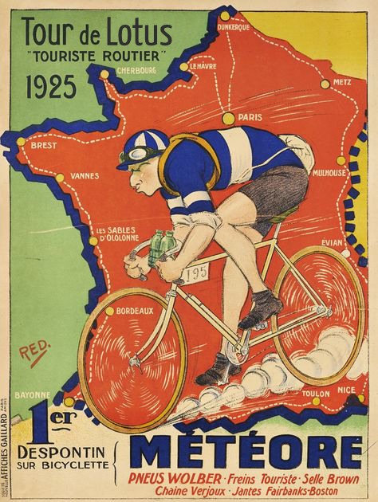
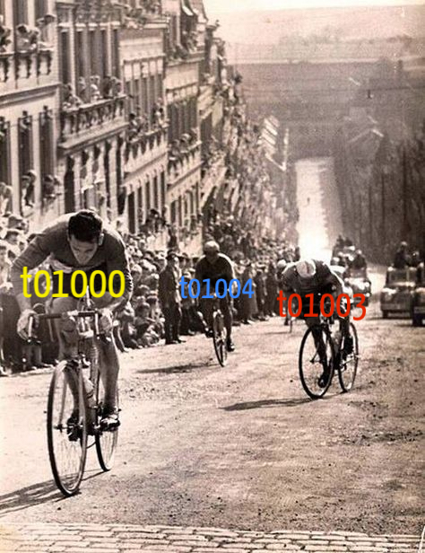

import { Head } from 'mdx-deck'
import { TourContext } from './theme'
export { default as theme } from './theme'
import { LiveCode } from 'mdx-deck-live-code'
// import LotusRPC from '@filecoin-shipyard/lotus-client-rpc';
// import LotusRPC from './lotus-client-rpc';
// import BrowserProvider from '@filecoin-shipyard/lotus-client-provider-browser';
// import BrowserProvider from './lotus-client-provider-browser';
// import schema from '@filecoin-shipyard/lotus-client-schema/prototype/testnet-v3.js';
import { useState, useEffect, useRef } from 'react'
import ReactJson from 'react-json-view'
import { useImmer } from 'use-immer'
import client from './client'
import useMiners from './use-miners'

<Head>
  <title>Tour de Lotus</title>
</Head>

  

    <h1 style={{fontSize: '47pt'}}>Tour de Lotus</h1>
  

  

    
  

---

Select a network:

  <input type='radio' name='net' value='localnet' defaultChecked={true} />
  Localnet

  <input type='radio' name='net' value='simulated' />
  Simulated

---

  

---

## Let's connect to our Node

---

<TourContext.Consumer>
  {tourContext => (
    <LiveCode
      title='ChainHead Height'
      size='fullscreen'
      code={require('!raw-loader!./chain-head-height.js')}
      providerProps={{
        scope: {
          client,
          useState,
          useEffect,
          tourContext,
          slideIndex: 4
        }
      }}
      editorProps={{ style: { fontSize: '0.4em', background: '#001628' } }}
    />
  )}
</TourContext.Consumer>

---

<LiveCode
  title='ChainHead Result'
  size='fullscreen'
  code={require('!raw-loader!./chain-head-result.js')}
  providerProps={{
    scope: {
      client,
      useState,
      useEffect,
      ReactJson
    }
  }}
  editorProps={{ style: { fontSize: '0.4em', background: '#001628' } }}
/>

---

<TourContext.Consumer>
  {tourContext => (
    <LiveCode
      title='ChainNotify Blocks'
      size='fullscreen'
      code={require('!raw-loader!./chain-notify-blocks.js')}
      providerProps={{
        scope: {
          client,
          useEffect,
          useRef,
          useImmer,
          tourContext,
          slideIndex: 6
        }
      }}
      editorProps={{ style: { fontSize: '0.4em', background: '#001628' } }}
    />
  )}
</TourContext.Consumer>

---

# State

---

<TourContext.Consumer>
  {tourContext => (
    <LiveCode
      title='State Power All'
      size='fullscreen'
      code={require('!raw-loader!./state/power-all.js')}
      providerProps={{
        scope: {
          client,
          useState,
          useEffect,
          tourContext,
          slideIndex: 8
        }
      }}
      editorProps={{ style: { fontSize: '0.4em', background: '#001628' } }}
    />
  )}
</TourContext.Consumer>

---

<TourContext.Consumer>
  {tourContext => (
    <LiveCode
      title='State List Miners'
      size='fullscreen'
      code={require('!raw-loader!./state/list-miners.js')}
      providerProps={{
        scope: {
          client,
          useState,
          useEffect,
          tourContext,
          slideIndex: 9
        }
      }}
      editorProps={{ style: { fontSize: '0.4em', background: '#001628' } }}
    />
  )}
</TourContext.Consumer>

---

<TourContext.Consumer>
  {tourContext => (
    <LiveCode
      title='State List Miners + Power'
      size='fullscreen'
      code={require('!raw-loader!./state/power-miners.js')}
      providerProps={{
        scope: {
          client,
          useImmer,
          useEffect,
          useMiners,
          tourContext,
          slideIndex: 10
        }
      }}
      editorProps={{ style: { fontSize: '0.4em', background: '#001628' } }}
    />
  )}
</TourContext.Consumer>

---
## Blocks

---

## State: Power

* StateNetworkName
* StateMinerPower
* StatePledgeCollateral

---

## State: Actors

* StateListActors
* StateGetActor
* StateReadState
* StateLookupID
* StateMarketBalance

---

# State: Miners

* StateListMiners
* StateMinerProvingSet
* StateMinerWorker
* StateMinerPeerID
* StateMinerPostState
* StateMinerSectorCount
* StateMinerFaults
* StateSectorPreCommitInfo
* StateListRewards

---

# State: Markets

* StateMarketDeals
* StateMarketStorageDeal

---

## State: Messages

* StateListMessages
* StateSearchMsg
* StateWaitMsg
* StateGetReceipt

---

# State: Other

* StateCall
* StateReplay
* StateCompute

---

## Syncing the Chain

---

## ChainHead JSON

---

## Tipsets

---

### State

---

## Addresses

---

## Messages

---

## Signing

---

## Message Pool

---

## Nodes

---

## Networking

---

## Miners

---

## Power

---

## Block Rewards

---

## Sectors

---

## Proofs

---

## Markets

---

## Asks

---

## Making Deals

---

## Deal Status

---

## Payment Channels

---

## Proving

---

## Actors
